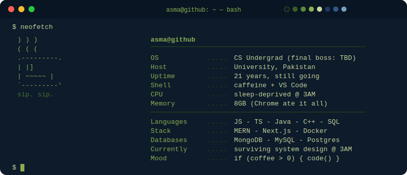

<p align="center">
  
</p>

<br/>

```bash
$ ls -la ./skills/
```

<br/>

<h4 align="center">— Languages —</h4>
<p align="center">
  
</p>

<br/>

```bash
$ github-stats --user AsmaSid11 --verbose
```

<br/>

<p align="center">
  
  
</p>

<p align="center">
  
</p>

<br/>

```bash
$ git log --graph --all --oneline
```

<br/>

<p align="center">
  
</p>

<br/>

```bash
$ ./snake --watch contributions
```

<br/>

<p align="center">
  
</p>

<br/>

```bash
$ ssh-keygen -t connect -C "asma@github"
```

<br/>

<p align="center">
  <a href="https://www.linkedin.com/in/asmasid11">
    
  </a>
  <a href="https://www.instagram.com/aa3corner?igsh=eDB1cGdpM3B1bXN0">
    
  </a>
  <a href="mailto:asmasiddiqui511@gmail.com">
    
  </a>
</p>

<p align="center">
  
</p>


